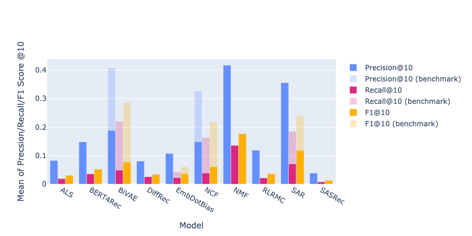

<!-- PROJECT SHIELDS -->
<!--
*** uses markdown "reference style" links for readability.
*** Reference links are enclosed in brackets [ ] instead of parentheses ( ).
*** See the bottom of this document for the declaration of the reference variables
*** https://www.markdownguide.org/basic-syntax/#reference-style-links
-->
[![Contributors][contributors-shield]][contributors-url]
[![Forks][forks-shield]][forks-url]
[![Stargazers][stars-shield]][stars-url]
[![Issues][issues-shield]][issues-url]
[![project_license][license-shield]][license-url]


<h3 align="center">Multi-Objective Recommendation Systems</h3>

  <p align="center">
    This project looked at implementing various multi-objective slate recommendation algorithms to investigate how to balance relevance and diversity within slates.
    <br />
    <a href="https://github.com/PracticeOrientedAICDT/Recommendations---Autumn-2025"><strong>Explore the code »</strong></a>
    <br />
    <a href="https://github.com/PracticeOrientedAICDT/Recommendations---Autumn-2025/wiki"><strong>Explore the wiki »</strong></a>
    <br />
    <br />
  </p>
</div>


<!-- TABLE OF CONTENTS -->
<details>
  <summary>Table of Contents</summary>
  <ol>
    <li>
      <a href="#about-the-project">About The Project</a>
    </li>
    <li>
      <a href="#getting-started">Getting Started</a>
      <ul>
        <li><a href="#prerequisites">Prerequisites</a></li>
        <li><a href="#installation">Installation</a></li>
      </ul>
    </li>
    <li><a href="#usage">Usage</a></li>
    <li><a href="#roadmap">Roadmap</a></li>
    <li><a href="#contributing">Contributing</a></li>
    <li><a href="#license">License</a></li>
    <li><a href="#contact">Contact</a></li>
    <li><a href="#acknowledgments">Acknowledgments</a></li>
  </ol>
</details>


<!-- ABOUT THE PROJECT -->
## About The Project

This project was part of the Practice Projects module in TB1 2025, for the Practice-Oriented AI CDT at the University of Bristol. 

There are two disparate strands in this project which investigated Top-N models and prompt-based models. Top-N models work by recommending the N most relevant movies for a specific user, based on their predicted ratings. Whereas, prompt-based models generate a slate of movies that fit a text-based prompt.

<p align="right">(<a href="#readme-top">back to top</a>)</p>


<!-- GETTING STARTED -->
## Getting Started

This project has multiple strands that work together.

### Top-N models
Top-N models are as follows, stored in the linked subfolders:
- [NMF](https://github.com/PracticeOrientedAICDT/Recommendations---Autumn-2025/tree/dev/models/matrix_factorisation)
- [Bert4Rec](https://github.com/PracticeOrientedAICDT/Recommendations---Autumn-2025/tree/dev/models/Bert4Rec-DiffRec%20-%20RecBole) *
- [DiffRec](https://github.com/PracticeOrientedAICDT/Recommendations---Autumn-2025/tree/dev/models/Bert4Rec-DiffRec%20-%20RecBole) *
- [Alternating Least Squares (ALS)](https://github.com/PracticeOrientedAICDT/Recommendations---Autumn-2025/tree/dev/models/als_movielens) **
- [BiVAE](https://github.com/PracticeOrientedAICDT/Recommendations---Autumn-2025/tree/dev/models/bivae_movielens) **
- [Embedding Dot Bias](https://github.com/PracticeOrientedAICDT/Recommendations---Autumn-2025/tree/dev/models/embdotbias_movielens) **
- [Neural Collaborative Filtering (NCF)](https://github.com/PracticeOrientedAICDT/Recommendations---Autumn-2025/tree/dev/models/ncf_movielens) **
- [RLRMC](https://github.com/PracticeOrientedAICDT/Recommendations---Autumn-2025/tree/dev/models/rlrmc_movielens) **
- [SAR](https://github.com/PracticeOrientedAICDT/Recommendations---Autumn-2025/tree/dev/models/sar_movielens) **
- [SASRec](https://github.com/PracticeOrientedAICDT/Recommendations---Autumn-2025/tree/dev/models/sasrec_movielens) **

Where * indates a model was adapted from the [RecBole](https://github.com/RUCAIBox/RecBole2.0) library, and ** indicates a model adapted from the [Microsoft Recommenders](https://github.com/recommenders-team/recommenders) library.

### Prompt-based models
The prompt-based models are as follows and are stored in the linked subfolders:
- [Enterprise LLM prompt-to-slate](https://github.com/PracticeOrientedAICDT/Recommendations---Autumn-2025/tree/dev/models/LLM_model)
- [Prompt guided diffusion model](https://uob.sharepoint.com/teams/grp-Recommender/Shared%20Documents/Forms/AllItems.aspx?id=%2Fteams%2Fgrp%2DRecommender%2FShared%20Documents%2FGeneral%2Fmovielens%5Fprompt%5Fdiffusion&p=true&ga=1)

## Prerequisites

Please see the README files in each model repository (linked above) for specific prerequisites and instructions.


## Installation

1. Clone the repo
   ```sh
   git clone https://github.com/PracticeOrientedAICDT/Recommendations---Autumn-2025.git
   ```
2. Download the MovieLens 1M Dataset from [here](https://grouplens.org/datasets/movielens/1m/) and store this in a folder called `ml1m` under the main `Dataset` folder, i.e. path should be `Dataset/ml-1m`
3. See individual model READMEs for additional configuration

<p align="right">(<a href="#readme-top">back to top</a>)</p>


<!-- USAGE EXAMPLES -->
## Usage
### Exploratory Data Analysis (EDA)
EDA on the MovieLens 1M dataset can be found in the following locations:
- Overall data analysis: [`ML1M_EDA.ipynb`](https://github.com/PracticeOrientedAICDT/Recommendations---Autumn-2025/blob/feature/readme/ML1M_EDA.ipynb)
<!-- - User profile analysis: <--- add here -->

### Top-N models
Specific usage varies between each model, and has been outlined in the README in each model's subdirectory. 

For example, in order to train and evaluate the NMF model the `MF_recommender_ml1m.ipynb` can be run in full and results can then be viewed in the `evals\eval_results` folder.

Once the results from all models have been compiled in the `evals\eval_results` folder; the `evals\offline_metrics_plotter.ipynb` notebook can be used to generate comparison plots such as the one shown below:



### Prompt-based models
Again specific usage varies between the models. Please follow the README's in the specific directories to generate slates.

The user testing code is available [here](https://github.com/PracticeOrientedAICDT/Recommendations---Autumn-2025/tree/dev/evals/user_testing). This code requires slates generated by each prompt-based model for a set of prompts to test. It then generates interactive slates for each of these within the user-testing web application, which is now live at https://movie-recs-navy.vercel.app

<p align="right">(<a href="#readme-top">back to top</a>)</p>


<!-- LICENSE -->
<!-- ## License

Distributed under the project_license. See `LICENSE.txt` for more information.

<p align="right">(<a href="#readme-top">back to top</a>)</p> -->


<!-- CONTACT -->
## Contact

### Team Members (alphabetical by surname):

- Ed Daniels: ed.daniels@bristol.ac.uk
- Guoda Laurinaviciute: guoda.laurinaviciute@bristol.ac.uk
- Abby Morris: abby.morris@bristol.ac.uk
- Ikechukwu Ofodile: ic.ofodile@bristol.ac.uk

### Top Contributors:

<a href="https://github.com/PracticeOrientedAICDT/Recommendations---Autumn-2025/graphs/contributors">
  
</a>


<p align="right">(<a href="#readme-top">back to top</a>)</p>


<!-- ACKNOWLEDGMENTS -->
## Acknowledgments

Thanks is given to Niall Twomey for mentoring this project and acting as our industry stakeholder. Thank you also to Kenton and Telmo for their support in class.

<p align="right">(<a href="#readme-top">back to top</a>)</p>


<!-- MARKDOWN LINKS & IMAGES -->
<!-- https://www.markdownguide.org/basic-syntax/#reference-style-links -->
[contributors-shield]: https://img.shields.io/github/contributors/PracticeOrientedAICDT/Recommendations---Autumn-2025.svg?style=for-the-badge
[contributors-url]: https://github.com/PracticeOrientedAICDT/Recommendations---Autumn-2025/graphs/contributors
[forks-shield]: https://img.shields.io/github/forks/PracticeOrientedAICDT/Recommendations---Autumn-2025.svg?style=for-the-badge
[forks-url]: https://github.com/PracticeOrientedAICDT/Recommendations---Autumn-2025/network/members
[stars-shield]: https://img.shields.io/github/stars/PracticeOrientedAICDT/Recommendations---Autumn-2025.svg?style=for-the-badge
[stars-url]: https://github.com/PracticeOrientedAICDT/Recommendations---Autumn-2025/stargazers
[issues-shield]: https://img.shields.io/github/issues/PracticeOrientedAICDT/Recommendations---Autumn-2025.svg?style=for-the-badge
[issues-url]: https://github.com/PracticeOrientedAICDT/Recommendations---Autumn-2025/issues
[license-shield]: https://img.shields.io/github/license/PracticeOrientedAICDT/Recommendations---Autumn-2025.svg?style=for-the-badge
[license-url]: https://github.com/PracticeOrientedAICDT/Recommendations---Autumn-2025/blob/master/LICENSE.txt
